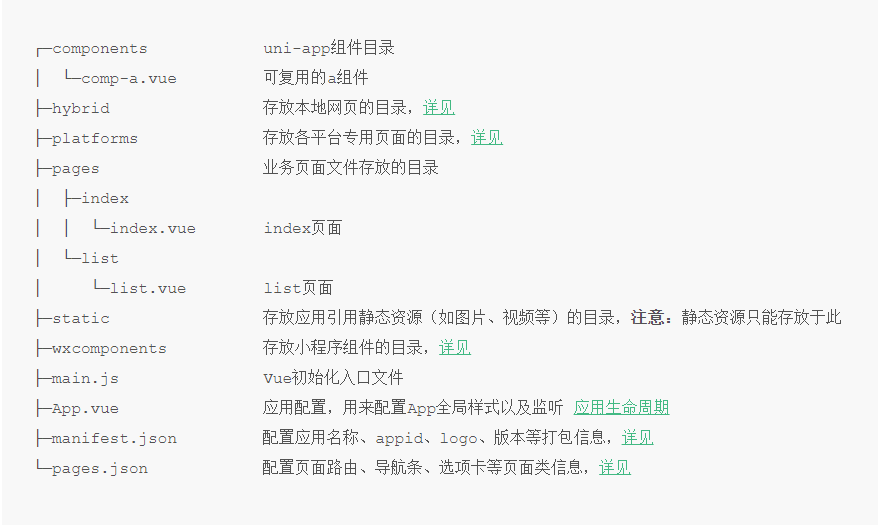

## Uni App开发规范
### (https://uniapp.dcloud.io/frame?id=%e5%bc%80%e5%8f%91%e8%a7%84%e8%8c%83)
- 页面文件遵循 Vue 单文件组件 (SFC) 规范
- 组件标签靠近小程序规范，详见uni-app 组件规范
- 接口能力（JS API）靠近微信小程序规范，但需将前缀 wx 替换为 uni，详见uni-app接口规范
- 数据绑定及事件处理同 Vue.js 规范，同时补充了App及页面的生命周期
- 为兼容多端运行，建议使用flex布局进行开发

## 目录结构
- 一个uni-app工程，默认包含如下目录及文件：
    
- Tips:
    - components 路径：可重用的组件
    - pages 路径：编写的页面文件
    - static 路径：需要用到的静态资源
    - App.vue ：配置全局生命周期的事件监听，全局的样式
    - manifest.json：app项目的配置中心
    - pages.json: 记录页面的路由关系，配置导航条，选项卡的json文件
    - static 目录下的 js 文件不会被编译，如果里面有 es6 的代码，不经过转换直接运行，在手机设备上会报错。
    - css、less/scss 等资源同样不要放在 static 目录下，建议这些公用的资源放在 common 目录下。
    - HbuilderX 1.9.0+ 支持在根目录创建 ext.json sitemap.json 文件。

## 页面生命周期

- uni-app 支持如下页面生命周期函数：

## 关于数据持久化
- 可以直接调用uni.set/getstorage 在app端进行数据持久化，在安卓端相当于键值对存入SQLite数据库

## uve 与 nuve页面区别
- 渲染机制不同，vue基于webview渲染，nvue基于app原生机制渲染
- 开发区别详见（https://uniapp.dcloud.io/use-weex?id=nvue%e5%bc%80%e5%8f%91%e4%b8%8evue%e5%bc%80%e5%8f%91%e7%9a%84%e5%b8%b8%e8%a7%81%e5%8c%ba%e5%88%ab）

## 关于uniapp后台服务
- 可以使用setinterval()定时器的形式，在后台不断间隔执行任务
- 经试验，clearinterval()只能在setinterval()相同的页面调用才能成功的关掉
- 如果想在另一页面关掉服务，可以借助uniapp的页面通讯机制发广播通知